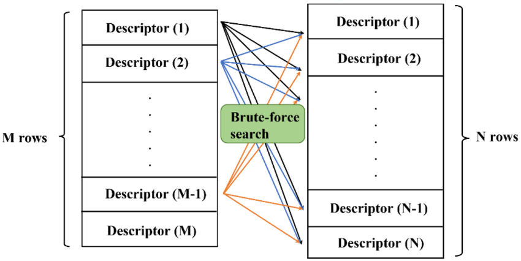
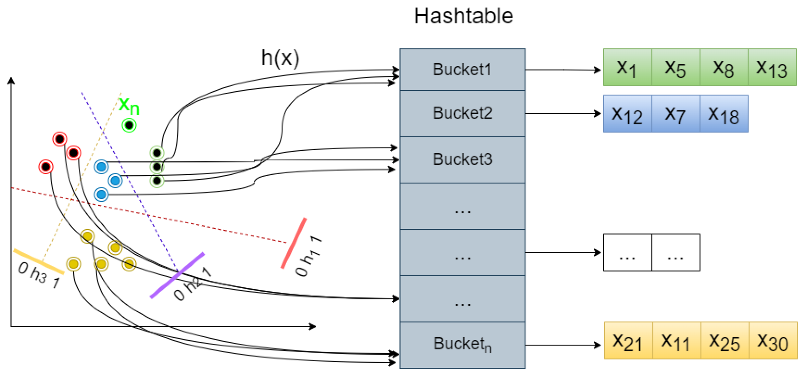
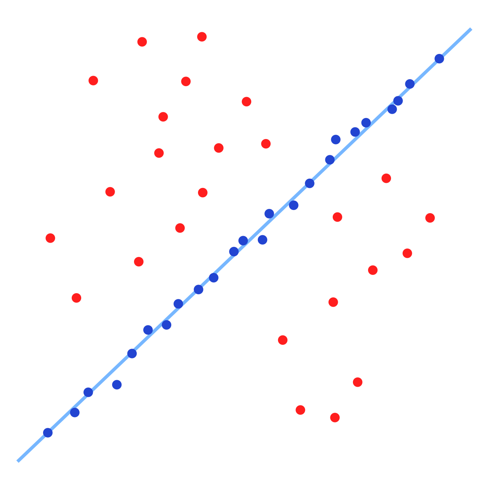

# Feature Matching Strategies: Brute Force, FLANN, and Ratio Test

Feature matching is a fundamental task in computer vision that involves finding corresponding keypoints (and their associated descriptors) between two or more images. This process is crucial for applications such as object recognition, image stitching, 3D reconstruction, and motion tracking. Once keypoints and their descriptors are extracted from images, a matching strategy is employed to identify which descriptors in one image correspond to which descriptors in another.

This document will explain three common feature matching strategies: **Brute-Force Matching**, **FLANN-based Matching**, and the **Ratio Test**.

---

## Feature Matching Strategies

### 1. Brute-Force (BF) Matching

The Brute-Force (BF) matcher is the most straightforward approach to finding correspondences between feature descriptors. It's conceptually simple but can be computationally intensive for large datasets.

**How it Works:**

1.  **Direct Comparison:** For each descriptor in the "query" image (the image you're trying to find matches for), the BF matcher compares it against *every single descriptor* in the "train" image (the image you're searching within).

2.  **Distance Metric:** The comparison is based on a chosen distance metric, which depends on the type of descriptor being used:

    * **Euclidean Distance (L2 Norm):** Typically used for float-point descriptors like SIFT and SURF. It measures the straight-line distance between two descriptor vectors in a multi-dimensional space.

    * **Hamming Distance:** Used for binary descriptors like ORB and BRIEF. It counts the number of positions at which the corresponding bits are different between two binary strings.

3.  **Best Match Selection:** For each query descriptor, the train descriptor with the smallest distance (closest match) is selected as its correspondence.

4.  **Cross-Check (Optional):** An optional but highly recommended step is "cross-checking." A match (A, B) is considered valid only if descriptor B is the best match for A in the train set, AND descriptor A is also the best match for B in the query set. This helps eliminate ambiguous matches and outliers.

**Advantages:**
* Simple to understand and implement.
* Guarantees finding the absolute best match (nearest neighbor) if no cross-check is applied.
* Works with any type of descriptor, provided the correct distance metric is chosen.

**Disadvantages:**
* **Computationally Expensive:** The time complexity is $O(N \times M)$, where $N$ is the number of query descriptors and $M$ is the number of train descriptors. This becomes very slow for large numbers of features.
* Less efficient for real-time applications compared to approximate methods.

### 2. FLANN-based Matching (Fast Library for Approximate Nearest Neighbors)

FLANN (Fast Library for Approximate Nearest Neighbors) is a highly optimized library designed for fast nearest neighbor searches in large datasets. It's often preferred over Brute-Force for its speed, especially with many features.

**How it Works:**

1.  **Index Building:** Instead of direct comparisons, FLANN first builds an optimized data structure (an "index") from the train descriptors. This index allows for much faster searches. The choice of index structure depends on the descriptor type:

    * **KD-Trees:** Used for float-point descriptors (like SIFT, SURF). A KD-tree recursively partitions the data space, making searches more efficient.

    * **Locality Sensitive Hashing (LSH):** Used for binary descriptors (like ORB, BRIEF). LSH is a powerful technique that maps high-dimensional data points into a lower-dimensional space, or "buckets," such that points that are close to each other in the original space (i.e., similar) are likely to fall into the same bucket. For binary descriptors, similarity is measured by Hamming distance. LSH achieves this by constructing multiple hash functions, where each function is designed to be "sensitive" to locality. This means that if two binary descriptors have a small Hamming distance (are very similar), their hash values are likely to be the same, allowing for quick identification of potential matches without exhaustively comparing every pair. This probabilistic approach significantly speeds up similarity searches, especially for very large collections of binary descriptors, making FLANN an excellent choice for real-time applications and large-scale image retrieval systems.

2.  **Approximate Nearest Neighbor Search:** When a query descriptor is given, FLANN uses its pre-built index to quickly find its *approximate* nearest neighbors. While not guaranteed to find the absolute closest match every time, it finds a very good approximation with high probability, significantly reducing search time.

3.  **Parameter Tuning:** FLANN allows for various parameters to be tuned (e.g., number of trees in KD-tree, number of checks for LSH) to balance between speed and accuracy.

**Advantages:**

* **Significantly Faster** than Brute-Force for large datasets.

* Highly scalable for large numbers of features.

* Flexible, supporting different index structures for various descriptor types.

**Disadvantages:**

* **Approximate Matches:** Does not guarantee finding the absolute best match, though the approximation is usually very good.

* Requires an initial time to build the index.

* More complex to set up and tune parameters compared to Brute-Force.

### 3. Ratio Test (Lowe's Ratio Test)

The Ratio Test, proposed by David Lowe (creator of SIFT), is a common filtering technique applied *after* an initial matching step (either Brute-Force or FLANN) to remove ambiguous or poor matches. It's based on the idea that a good match should be significantly closer to its best match than to its second-best match.

**How it Works:**

1.  **Find K-Nearest Neighbors (k=2):** For each query descriptor, find its two closest neighbors in the train set. Let $d_1$ be the distance to the closest neighbor and $d_2$ be the distance to the second closest neighbor.

2.  **Calculate Ratio:** Compute the ratio of these two distances: $Ratio = \frac{d_1}{d_2}$.

3.  **Apply Threshold:** If $Ratio < \text{threshold}$ (e.g., 0.7 or 0.8, a common value is 0.75), then the match is considered good and kept. Otherwise, it's discarded.

**Rationale:**

* If a descriptor is truly distinctive, its best match ($d_1$) should be much closer than its second-best match ($d_2$).

* If $d_1$ and $d_2$ are very similar (i.e., the ratio is close to 1), it indicates that the descriptor is ambiguous and could easily match to multiple points, making it an unreliable correspondence. Such matches are often outliers or belong to repetitive patterns.

**Advantages:**

* **Effectively filters out false positive matches (outliers).**

* Significantly improves the quality and robustness of the final set of matches.

* Relatively simple to implement as a post-processing step.

**Disadvantages:**

* Requires finding at least two nearest neighbors for each query descriptor, which might add a small computational overhead if the initial matching only finds one.

* The choice of threshold can impact the number of matches and accuracy (a lower threshold yields fewer but more reliable matches).

* It's a filtering step, not a matching algorithm itself.

### 4. RANSAC (Random Sample Consensus)

RANSAC (Random Sample Consensus) is a powerful and widely used iterative method for estimating the parameters of a mathematical model from a set of observed data containing outliers. In the context of feature matching, RANSAC is crucial for finding a robust geometric transformation (e e.g., homography, fundamental matrix, affine transform) that aligns two images, by effectively identifying and discarding "geometric outliers" among the initially matched features.

**Purpose and Principle:**

Even after applying descriptor-level filters like the Ratio Test, some incorrect matches (outliers) will inevitably remain. These outliers can severely corrupt the estimation of geometric transformations. RANSAC's strength lies in its ability to estimate model parameters (like the transformation matrix) from a minimal subset of data, and then iteratively refine this estimate by identifying other data points that are consistent with the model (inliers), while ignoring the rest (outliers).

**How RANSAC Works in Feature Matching:**

1.  **Random Sample Selection:**
    * From the set of initial feature matches (which may still contain outliers), RANSAC randomly selects a minimal subset of matches required to estimate the chosen geometric model. For example:
        * To estimate a **homography** (for planar scenes), 4 non-collinear point correspondences are needed.
        * To estimate a **fundamental matrix** (for uncalibrated stereo vision), 7 or 8 point correspondences are typically used.
        * To estimate an **affine transformation**, 3 non-collinear point correspondences are needed.

2.  **Model Estimation:**
    * Using this minimal subset of randomly chosen matches, the parameters of the geometric model are calculated. For instance, if estimating a homography, a $3 \times 3$ transformation matrix is computed that maps the coordinates of the source points to the destination points.

3.  **Inlier Consensus Set Formation:**
    * The estimated model is then applied to *all* other initial matches. For each match, the distance between the transformed source point and the actual destination point is calculated (e.g., using symmetric epipolar distance for fundamental matrix, or re-projection error for homography).
    * If this distance is below a predefined **threshold** (the "inlier threshold"), the match is considered an "inlier" to the current model hypothesis. All inliers form a "consensus set."

4.  **Iteration and Best Model Selection:**
    * Steps 1-3 are repeated for a fixed number of iterations. In each iteration, a new random subset is chosen, a new model is estimated, and a new consensus set is formed.
    * The model that produces the **largest consensus set** (i.e., has the most inliers) is considered the best model.

5.  **Final Model Refinement (Optional):**
    * Once the best model is identified, its parameters can be refined using all the matches identified as inliers in its consensus set. This often involves a more precise optimization method (e.g., least squares) on the inlier set to get a more accurate final transformation.

**Advantages:**

* **Extreme Robustness to Outliers:** RANSAC can tolerate a very high percentage of outliers (up to 50% or more, theoretically), making it indispensable for real-world image data where noisy matches are common.
* **Generic:** It can be applied to estimate parameters for a wide variety of mathematical models, not just geometric transformations.
* **No Prior Knowledge of Outliers:** It doesn't require knowing which matches are outliers beforehand.

**Disadvantages:**

* **Non-Deterministic:** Because of its random sampling, there's a chance it might not find the optimal model, especially with a very high percentage of outliers or a low number of iterations.
* **Computational Cost:** The number of iterations can be high, especially if the proportion of inliers is low, leading to significant computational time.
* **Threshold Sensitivity:** The "inlier threshold" is a crucial parameter that needs to be carefully chosen. A too-small threshold might reject good matches, while a too-large one might accept too many outliers.
* **Not Suitable for All Models:** While versatile, it's most effective for models that can be estimated from a minimal set of data points.

## 5. Geometric Verification: Vote-Based Methods (e.g., Generalized Hough Transform)

Beyond direct descriptor comparison and iterative geometric RANSAC filtering, another powerful category of robust feature matching and object recognition involves **vote-based methods**, with the **Generalized Hough Transform (GHT)** being a prominent example. These methods work by having individual feature correspondences "vote" for potential transformations or object instances, accumulating evidence in a parameter space. This approach is particularly effective for object recognition in cluttered scenes, even with partial occlusion, and can implicitly handle outlier rejection.

**Purpose and Principle:**

Instead of attempting to find a globally consistent set of matches directly, vote-based methods leverage local evidence provided by individual feature pairings. Each match (a pair of a feature from a known model/template and a feature from the input image) generates one or more hypotheses about the transformation parameters that would align the model to the image. These hypotheses are then aggregated into a multi-dimensional accumulator array, and the transformation parameters that receive the most "votes" are considered the most probable and robust.

**How Vote-Based Methods Work in Feature Matching (using GHT as an example):**

1.  **Model Pre-processing (R-table creation):** For each object model or template that needs to be recognized, a "reference table" (R-table) is pre-calculated. For every feature detected on the model, the R-table stores information such as:
    * The vector from the feature's position to a chosen object reference point (e.g., the object's centroid).
    * The orientation of the feature relative to the model's chosen orientation.
    This table effectively encodes how each model feature "points" to the object's origin under a canonical pose.

2.  **Feature Matching and Voting:**
    * Features are detected in the input (query) image, and their descriptors are computed.
    * For each feature detected in the input image, its corresponding matches are found within the pre-computed features of the object models (e.g., using a fast nearest-neighbor search like FLANN or Brute-Force).
    * For each valid match $(F_{image}, F_{model})$ (where $F_{image}$ is a feature from the input image and $F_{model}$ is a feature from the object model):
        * The reference vectors and orientations stored in the R-table for $F_{model}$ are retrieved.
        * These reference vectors are then dynamically adjusted based on the observed scale and rotation difference between $F_{image}$ and $F_{model}$ in the current match. This adjustment transforms the model's reference point into the image's coordinate system.
        * Each adjusted reference vector indicates a possible location for the object's reference point in the input image, along with other transformation parameters (like rotation and scale).
        * A "vote" is cast by incrementing the corresponding "bin" in a multi-dimensional accumulator array. Each dimension of this array represents a parameter of the transformation (e.g., X translation, Y translation, rotation angle, scale).

3.  **Peak Detection:** After all feature matches have cast their votes, the accumulator array will contain various values. Prominent "peaks" in this array indicate a strong consensus for specific sets of transformation parameters. A high peak implies that many different feature correspondences agree on a particular object pose or location, making it a highly probable detection.

4.  **Verification (Optional):** Once potential transformations are identified by the peaks, an optional verification step can be performed. This involves re-projecting the model's features (or the entire object boundary) using the detected peak transformation parameters and checking for consistency with additional image features or object boundaries. This helps to confirm the detection and refine the estimated pose.

**Advantages:**

* **Robustness to Occlusion and Clutter:** Individual incorrect matches or occluded features do not significantly degrade performance, as the method relies on a robust consensus built from many votes. Incorrect votes are diffused across the accumulator space.
* **Multiple Instance Detection:** The method can inherently detect multiple instances of the same object within a single image if they lead to distinct and sufficiently high peaks in the accumulator array.
* **Handles Complex Transformations:** Can be extended to estimate various transformation types (translation, rotation, scale, and even some non-rigid deformations) by increasing the dimensionality of the accumulator array, although this comes with caveats.
* **Implicit Outlier Rejection:** Matches that do not fit a common transformation (i.e., are outliers) will cast votes randomly across the accumulator space and therefore will not contribute to a significant, coherent peak.

**Disadvantages:**

* **High Computational and Memory Cost:** The accumulator array can become very large and memory-intensive, especially when searching for transformations with many parameters (e.g., 6D pose). This often necessitates coarse quantization of the parameter space, which can affect precision.
* **Sensitivity to Parameter Quantization:** The size and resolution of the accumulator bins affect both memory consumption and the precision of the detected transformation. A finer grid provides better precision but requires more resources.
* **Requires Pre-computation:** The R-table for each model needs to be pre-calculated and stored, which can be significant for many models or complex features.

---

## Updated Summary Comparison

| Strategy                      | Primary Function                       | Speed (for large datasets) | Accuracy (of individual match) | Outlier Rejection | Descriptor Types | Typical Use Cases                                                      |
| :---------------------------- | :------------------------------------- | :------------------------- | :----------------------------- | :---------------- | :---------------- | :--------------------------------------------------------------------- |
| **Brute-Force (BF)** | Exact Nearest Neighbor Search          | Slow                       | High (exact NN)                | Low (without filters) | All               | Small datasets, simple cases, debugging.                               |
| **FLANN** | Approximate Nearest Neighbor Search    | Very Fast                  | High (approximate NN)          | Low (without filters) | All               | Large datasets, real-time applications.                                |
| **Ratio Test** | Descriptor-Level Filtering             | N/A (post-processing)      | N/A (improves quality)         | High              | All               | Post-filtering after BF/FLANN to remove ambiguous matches.              |
| **RANSAC** | Geometric Outlier Rejection / Model Estimation | N/A (iterative post-processing) | N/A (improves geometric consistency) | Very High         | All               | Image stitching, 3D reconstruction, object pose estimation.            |
| **Vote-Based (e.g., GHT)** | Object Detection / Geometric Consensus | Moderate to Slow (depending on params) | High (for transformation)      | High (implicit)   | All               | Object recognition under occlusion/clutter, multi-instance detection. |

---

## When to Use Which Strategy

The choice of feature matching strategy depends heavily on the specific application's requirements for speed, memory, and robustness to image transformations and noise. A practical pipeline often involves a combination of these methods.

* **Brute-Force (BF) Matching:**
    * **When to Use:** Ideal for **small datasets of features** (e.g., hundreds, not thousands) where computational time is not a bottleneck. When **absolute precision** in finding the nearest neighbor is critical, and the exhaustive search is tolerable. Useful for debugging or when dealing with highly unique features where ambiguity is low.
    * **Avoid When:** Dealing with a large number of features, real-time applications, or when speed is a primary concern.

* **FLANN-based Matching:**
    * **When to Use:** The go-to choice for **large datasets of features** (thousands to millions). When **real-time or near real-time performance** is required. Offers an excellent balance between speed and accuracy for most practical computer vision tasks. Works well with both float and binary descriptors due to its support for KD-Trees and LSH.
    * **Consider Tuning:** Be aware that optimal performance may require tuning the underlying index parameters (e.g., number of trees for KD-Tree, number of tables for LSH) based on your specific dataset and the desired accuracy-speed trade-off.

* **Ratio Test (Lowe's Ratio Test):**
    * **When to Use:** **Always** as a crucial post-processing step after initial nearest-neighbor matching (whether performed by BF or FLANN). It is highly effective at filtering out **ambiguous matches and descriptor-level outliers**, significantly improving the quality and reliability of the initial matches before any geometric estimation. Essential for robust object recognition and image registration.
    * **Note:** It should *not* be used as a standalone matching method but rather as a filter applied to candidate matches. The threshold (e.g., 0.75 for SIFT) might need slight adjustment depending on the application's specific tolerance for false positives versus true positives.

* **RANSAC (Random Sample Consensus):**
    * **When to Use:** **Crucial for almost all applications involving geometric transformations** derived from feature matches (e.g., image stitching, camera calibration, object pose estimation, simultaneous localization and mapping (SLAM)). It is indispensable for filtering out **geometric outliers** that might pass descriptor-level tests, and for robustly finding a mathematically consistent transformation that explains the majority of true correspondences.
    * **Avoid When:** If you only need descriptor similarity and no geometric relationship is being estimated (though such cases are rare in practical computer vision pipelines that use feature matching). It introduces a non-deterministic element and adds computational cost due to its iterative nature.

* **Vote-Based Methods (e.g., Generalized Hough Transform):**
    * **When to Use:** Primarily for **object detection and recognition in cluttered scenes**, especially when dealing with **occlusion** or multiple instances of the same object. When a high degree of robustness to outliers and partial visibility is needed, and the specific geometric transformation (e.g., object pose) is the primary output. Can be useful when a clear peak in a parameter space is expected.
    * **Avoid When:** Computational and memory resources are extremely limited, or when the transformation space is too high-dimensional (leading to a sparse accumulator). For simple one-to-one image registration without object recognition needs, RANSAC is usually more efficient.
---
## Conclusion
In summary, a robust feature matching and object localization pipeline typically combines an efficient approximate nearest neighbor search (FLANN) with a robust descriptor-level filter (Ratio Test), followed by a powerful geometric validation step (RANSAC) or an evidence-accumulating approach (Vote-Based Methods) for complex object recognition tasks. This layered approach ensures both speed and accuracy, leading to reliable results in diverse real-world computer vision scenarios.
