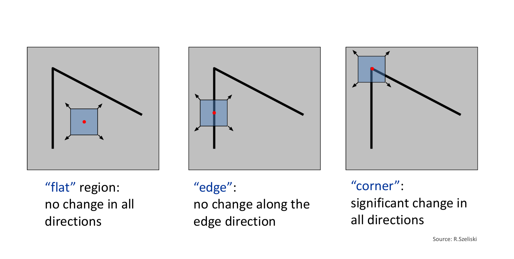

# Harris Corner Detector
The Harris Corner Detector is a widely used algorithm in computer vision for identifying "corners" in an image. A corner is generally understood as a point where there are significant intensity changes in multiple directions, making it a stable and distinctive feature for tasks like object recognition, tracking, and image stitching.

Let's break down the mathematics behind it:

### 1. The Basic Idea: Intensity Change with Shift

The fundamental concept behind the Harris corner detector is that a small window (or patch) around a corner will show a large change in image intensity if you shift that window in *any* direction.

Let $I(x, y)$ be the intensity of the image at pixel $(x, y)$.
Consider a small window $W$ centered at a point $(x, y)$.
If we shift this window by a small amount $(u, v)$, the "change in intensity" $E(u, v)$ can be quantified by the Sum of Squared Differences (SSD) between the original window and the shifted window:

$$E(u, v) = \sum_{(x, y) \in W} w(x, y) [I(x+u, y+v) - I(x, y)]^2$$

Where:
* $w(x, y)$ is a window function (e.g., a rectangular window or a Gaussian window) that gives more weight to pixels closer to the center of the window.

### 2. Taylor Series Approximation

To make this mathematically tractable for *any* small shift $(u, v)$, we use a first-order Taylor series expansion of $I(x+u, y+v)$ around $I(x, y)$:

$$I(x+u, y+v) \approx I(x, y) + I_x u + I_y v$$

Where $I_x = \frac{\partial I}{\partial x}$ and $I_y = \frac{\partial I}{\partial y}$ are the partial derivatives of the image intensity with respect to x and y, respectively (i.e., the image gradients). These are typically computed using a Sobel filter.

Substitute this approximation into the $E(u, v)$ equation:

$$E(u, v) \approx \sum_{(x, y) \in W} w(x, y) [ (I(x, y) + I_x u + I_y v) - I(x, y) ]^2$$
$$E(u, v) \approx \sum_{(x, y) \in W} w(x, y) (I_x u + I_y v)^2$$

Expand the squared term:

$$E(u, v) \approx \sum_{(x, y) \in W} w(x, y) (I_x^2 u^2 + 2 I_x I_y u v + I_y^2 v^2)$$

Rearrange into a quadratic form (matrix notation):

$$E(u, v) \approx \begin{bmatrix} u & v \end{bmatrix} \left( \sum_{(x, y) \in W} w(x, y) \begin{bmatrix} I_x^2 & I_x I_y \\ I_x I_y & I_y^2 \end{bmatrix} \right) \begin{bmatrix} u \\ v \end{bmatrix}$$

### 3. The Structure Tensor (or Harris Matrix)

The $2 \times 2$ matrix inside the summation is called the **Structure Tensor** or **Harris Matrix**, denoted by $M$:

$$M = \sum_{(x, y) \in W} w(x, y) \begin{bmatrix} I_x^2 & I_x I_y \\ I_x I_y & I_y^2 \end{bmatrix}$$

Each element of $M$ is a sum (or weighted sum, if $w(x,y)$ is a Gaussian) over the window $W$:
* $A = \sum_{(x, y) \in W} w(x, y) I_x^2$
* $B = \sum_{(x, y) \in W} w(x, y) I_y^2$
* $C = \sum_{(x, y) \in W} w(x, y) I_x I_y$

So, $M$ can be written as:
$$M = \begin{bmatrix} A & C \\ C & B \end{bmatrix}$$

Now, the change in intensity $E(u, v)$ simplifies to:
$$E(u, v) \approx \begin{bmatrix} u & v \end{bmatrix} M \begin{bmatrix} u \\ v \end{bmatrix}$$

### 4. Interpreting the Structure Tensor with Eigenvalues

The behavior of $E(u, v)$ for different shifts $(u, v)$ is determined by the eigenvalues ($\lambda_1$, $\lambda_2$) of the matrix $M$. The eigenvalues represent the principal curvatures of the intensity variation surface.

* If both $\lambda_1$ and $\lambda_2$ are **small**, it means that $E(u, v)$ is small for any shift, indicating a **flat region** with little intensity change.
* If one eigenvalue is **large** and the other is **small** (e.g., $\lambda_1 \gg \lambda_2 \approx 0$), it means there is a strong intensity change in one direction, but little change in the orthogonal direction. This indicates an **edge**.
* If both $\lambda_1$ and $\lambda_2$ are **large** and similar in magnitude ($\lambda_1 \approx \lambda_2 \gg 0$), it means there's a strong intensity change in all directions. This is the characteristic of a **corner**.

### 5. The Harris Corner Response Function (R)

Calculating eigenvalues for every pixel is computationally expensive. Harris and Stephens proposed a more efficient "corner response" function $R$ that avoids explicit eigenvalue computation, yet still captures the same information:

$$R = \det(M) - k (\text{trace}(M))^2$$

Where:
* $\det(M)$ is the determinant of $M$: $\det(M) = AB - C^2 = \lambda_1 \lambda_2$
* $\text{trace}(M)$ is the trace of $M$: $\text{trace}(M) = A + B = \lambda_1 + \lambda_2$
* $k$ is an empirically determined constant, typically in the range $[0.04, 0.06]$. This parameter acts as a sensitivity threshold.

Substituting the eigenvalue relationships:

$$R = \lambda_1 \lambda_2 - k (\lambda_1 + \lambda_2)^2$$

### 6. Thresholding and Non-Maximum Suppression

After computing the $R$ value for every pixel in the image:

1.  **Thresholding:** A threshold is applied to $R$. Pixels with $R$ values above this threshold are considered potential corners.
    * If $R$ is large and positive, it's a corner ($\lambda_1$ and $\lambda_2$ are both large).
    * If $R$ is large and negative, it's an edge (one eigenvalue is much larger than the other, making $k(\lambda_1 + \lambda_2)^2$ dominate).
    * If $|R|$ is small, it's a flat region ($\lambda_1$ and $\lambda_2$ are both small).
2.  **Non-Maximum Suppression:** Since a corner might span several pixels, the thresholded response often results in clusters of high $R$ values. Non-maximum suppression is applied to find the local maxima within these clusters, ensuring that only one point (the most prominent) is selected for each corner.

### Summary of Steps:

1.  Convert the image to grayscale (if it's not already).
2.  Compute the image gradients $I_x$ and $I_y$ using a suitable filter (e.g., Sobel operators).
3.  Compute the products of gradients: $I_x^2$, $I_y^2$, and $I_x I_y$.
4.  Apply a Gaussian filter (or another smoothing filter) to these products to compute the components of the Structure Tensor $A$, $B$, and $C$. This effectively computes the weighted sums over the window $W$.
5.  For each pixel, construct the Structure Tensor $M = \begin{bmatrix} A & C \\ C & B \end{bmatrix}$.
6.  Calculate the Harris corner response $R = \det(M) - k (\text{trace}(M))^2$ for each pixel.
7.  Apply a threshold to the $R$ values to identify candidate corners.
8.  Perform non-maximum suppression to refine the corner locations and eliminate redundant detections.

The Harris corner detector is robust to rotation, small changes in illumination, and minor perspective changes, making it a powerful tool in many computer vision applications.