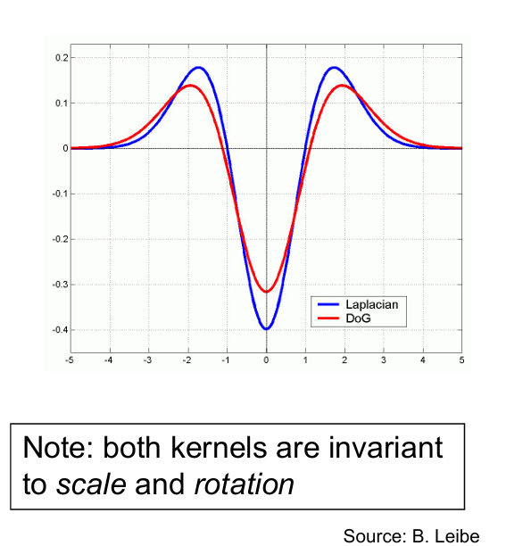
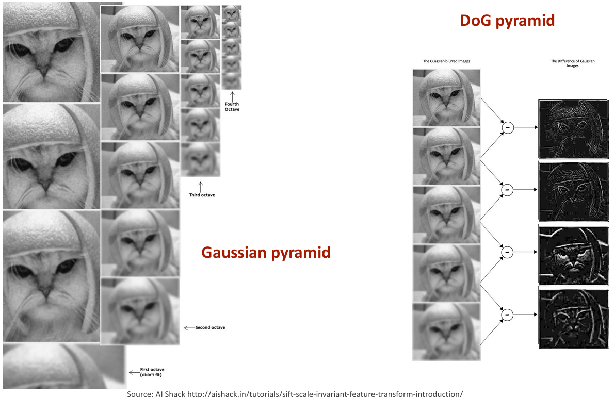
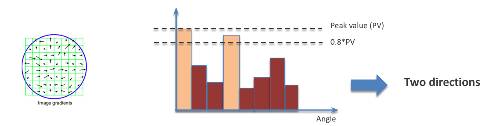
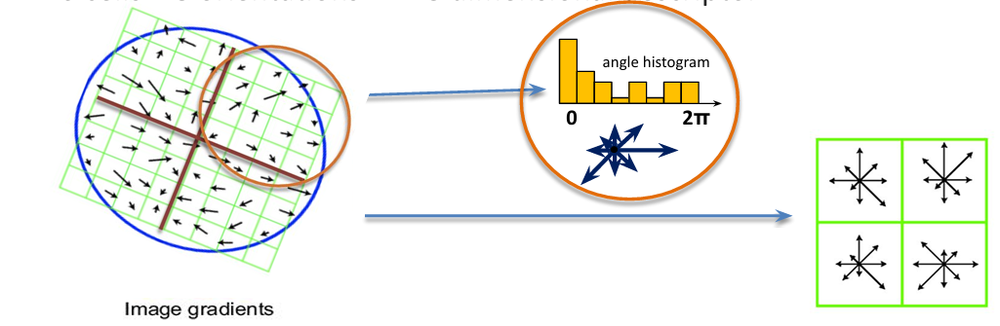

# SIFT: Scale-Invariant Feature Transform

The **Scale-Invariant Feature Transform (SIFT)**, developed by David Lowe, is a powerful algorithm for detecting and describing local features in images. Its primary strength lies in its **invariance to scale, rotation**, and partial invariance to illumination changes and 3D viewpoint changes. This makes SIFT features incredibly robust for tasks like object recognition, image matching, and panorama stitching.

This document provides a detailed breakdown of the SIFT implementation, focusing on three core stages: **Difference of Gaussians (DoG), Keypoint Localization, Orientation Assignment and Keypoint Descriptor Generation.**

---

## SIFT Implementation Steps

The SIFT algorithm typically follows a four-stage process:

1.  **Scale-Space Extrema Detection (using DoG)**
2.  **Keypoint Localization**
3.  **Orientation Assignment**
4.  **Keypoint Descriptor Generation** 

---

## 1. Scale-Space Extrema Detection (Difference of Gaussians - DoG)

This stage aims to identify potential interest points that remain stable across various scales. It leverages the idea that the scale-normalized Laplacian of Gaussian ($\sigma^2 \nabla^2 G$) excels at blob detection across different scales. However, computing LoG is computationally intensive. Lowe's solution was to use the **Difference of Gaussians (DoG)** as an efficient approximation of LoG.

### Process:

### a. Gaussian Pyramid Construction

* Start with the input image (usually converted to grayscale).
* Create multiple **"octaves"** (levels) of the image pyramid, each with a different base resolution.
* Within each octave, generate several **"scale levels"** (blurred versions of the image) by convolving the image with Gaussian filters of incrementally increasing standard deviations ($\sigma$).
    * **Initial Image Expansion (Optional but Recommended):** For better detection of smaller features and proper sampling, the input image is often doubled in size (upsampled) and blurred with a small initial $\sigma$ (e.g., 0.5) before starting the first octave.
    * **Number of Scales per Octave (s):** For robust keypoint detection, Lowe recommends generating `s+3` (or `s+2` in some implementations) images per octave. A typical value for `s` is 3, resulting in 5 or 6 images per octave.
    * **Gaussian $\sigma$ Progression:** Within an octave, if the base blur is $\sigma_{base}$, subsequent levels are blurred with $\sigma_{base} \cdot k$, $\sigma_{base} \cdot k^2$, ..., $\sigma_{base} \cdot k^{s+2}$, where $k = 2^{1/s}$. This ensures that the total blurring for the last image in an octave is double that of the first image in the octave.
    * **Next Octave Generation:** The first image of the subsequent octave is created by downsampling (usually by a factor of 2) the third-to-last (or second-to-last, depending on the `s+x` choice) image of the current octave. This maintains an appropriate level of blur for the new octave's start.

### b. DoG Pyramid Construction

* For each octave, generate DoG images by subtracting adjacent Gaussian-blurred images:
    $$D(x, y, \sigma) = L(x, y, k\sigma) - L(x, y, \sigma)$$
    where $L(x, y, \sigma) = G(x, y, \sigma) * I(x, y)$ (convolution with Gaussian).
* If you have `s+3` Gaussian images in an octave, you'll end up with `s+2` DoG images.

### c. Extrema Detection

* Iterate through each pixel in the DoG images to find local maxima and minima across both space (x, y) and scale ($\sigma$).
* A pixel is considered a potential **keypoint** if it is a local extremum compared to its **26 neighbors**:
    * Its 8 immediate neighbors in the current DoG image.
    * Its 9 neighbors (including itself) in the DoG image above (finer scale).
    * Its 9 neighbors (including itself) in the DoG image below (coarser scale).
* If the pixel's value is greater than all 26 neighbors, or smaller than all 26 neighbors, it's marked as a candidate keypoint.

---

## 2. Keypoint Localization

The extrema found in the DoG images are discrete. This stage refines their location to sub-pixel accuracy, determines their precise scale, and discards unstable keypoints that are either low in contrast or exhibit strong edge responses.

### Process:

### a. Sub-pixel Refinement (Taylor Series Expansion)

* For each candidate keypoint, a 3D quadratic function (Taylor series expansion) is fit to the local sample points around the extremum.
* Let $D(x, y, \sigma)$ be the DoG function. We want to find the precise extremum $(x', y', \sigma')$ near the discrete keypoint $(x, y, \sigma)$.
* The Taylor expansion of $D$ around a candidate point $X = (x, y, \sigma)^T$ is:
    $$D(X + \delta X) = D(X) + \frac{\partial D^T}{\partial X} \delta X + \frac{1}{2} \delta X^T \frac{\partial^2 D}{\partial X^2} \delta X$$
* To find the extremum, we take the derivative with respect to $\delta X$ and set it to zero:
    $$\delta X = - \frac{\partial^2 D^{-1}}{\partial X^2} \frac{\partial D}{\partial X}$$
* If any component of $\delta X$ is greater than 0.5 (meaning the extremum is closer to an adjacent sample point), the keypoint is moved to that adjacent sample point, and the interpolation is repeated. This iterative refinement continues until the offset is small or a maximum number of iterations is reached.
* The new sub-pixel location is $X + \delta X$. The value of $D(X + \delta X)$ at this refined extremum is used for the contrast check.

### b. Discarding Low-Contrast Keypoints

* If the absolute value of the interpolated DoG value at the refined keypoint location $|D(X + \delta X)|$ falls below a certain threshold (e.g., 0.03 in Lowe's paper), the keypoint is considered **low-contrast** and is discarded. These points often represent noise or weak feature information.

### c. Eliminating Edge Responses

* DoG often produces strong responses along edges, which are undesirable keypoints because they're not well-localized in all directions. To remove these, a technique similar to the Harris corner detector is employed.
* The **2x2 Hessian matrix** $H$ is computed at the keypoint's refined location and scale in the DoG image:
    $$H = \begin{bmatrix} D_{xx} & D_{xy} \\ D_{xy} & D_{yy} \end{bmatrix}$$
    where $D_{xx}$, $D_{yy}$, $D_{xy}$ are second partial derivatives of $D$.
* The eigenvalues of $H$ (let them be $\alpha$ and $\beta$) represent the principal curvatures of the DoG function.
    * For **edges**, one eigenvalue is significantly larger than the other ($\alpha \gg \beta$).
    * For **corners**, both eigenvalues are large and similar ($\alpha \approx \beta$).
* To check for edge responses, Lowe uses the ratio of eigenvalues:
    $$\frac{(\text{trace}(H))^2}{\det(H)} = \frac{(D_{xx} + D_{yy})^2}{D_{xx}D_{yy} - D_{xy}^2} = \frac{(\alpha + \beta)^2}{\alpha \beta}$$
* If this ratio exceeds a threshold (e.g., 10 in Lowe's paper), the keypoint is considered an edge and is discarded. This effectively filters out poorly localized features.

---

## 3. Orientation Assignment

To achieve **rotation invariance**, one or more orientations are assigned to each keypoint based on the local image gradient directions. All subsequent operations (like descriptor generation) are then performed relative to this assigned orientation.

### Process:

### a. Gradient Magnitude and Direction Calculation

* For each refined keypoint, a neighborhood around its detected location and scale (determined by $\sigma$) is considered in the **Gaussian-blurred image** at that specific scale (not the DoG image).
* For each pixel $(x, y)$ within this neighborhood, calculate the gradient magnitude $M(x, y)$ and orientation $\theta(x, y)$:
    $$M(x, y) = \sqrt{(L(x+1, y) - L(x-1, y))^2 + (L(x, y+1) - L(x, y-1))^2}$$
    $$\theta(x, y) = \text{atan2}(L(x, y+1) - L(x, y-1), L(x+1, y) - L(x-1, y))$$
    (where $L$ is the Gaussian-blurred image at the keypoint's scale).

### b. Orientation Histogram

* An **orientation histogram** with 36 bins (each covering 10 degrees) is created for the keypoint.
* Each gradient sample (magnitude and orientation) within the neighborhood contributes to this histogram.
* **Weighting:** Each contribution is weighted by its gradient magnitude and by a Gaussian-weighted circular window centered at the keypoint. The $\sigma$ of this Gaussian window is typically 1.5 times the scale of the keypoint. This weighting prioritizes pixels closer to the keypoint center and those with stronger gradients.

### c. Peak Detection and Multiple Orientations

* The **highest peak** in the orientation histogram is identified. The angle corresponding to this peak is assigned as the **primary orientation** for the keypoint.
* To further enhance robustness, any other local peak in the histogram that is within **80% of the highest peak's magnitude** is also considered. If such a peak exists, a **new keypoint** is created at the exact same location and scale, but with this secondary orientation. This allows a single image feature to generate multiple SIFT keypoints if there are multiple dominant orientations in its vicinity (e.g., the corners of a square).

---

## 4. Keypoint Descriptor Generation

The final and crucial stage of the SIFT algorithm is the **Keypoint Descriptor Generation**. After identifying stable, localized, and oriented keypoints, the goal here is to create a unique, compact, and highly distinctive feature vector for each keypoint. This descriptor should be invariant to rotation, scale, and robust to illumination changes and minor viewpoint variations.

### The Goal: A Robust Fingerprint for Each Keypoint

The descriptor effectively summarizes the local image content around the keypoint in a standardized way, making it comparable to descriptors from other images (even if they were taken at different scales, rotations, or lighting conditions).

### Process:

The generation of the 128-dimensional SIFT descriptor involves several detailed steps:

#### a. Create a Rotated and Scaled Neighborhood

1.  **Select Region:** A square region around the keypoint is considered. The size of this region depends on the keypoint's scale ($\sigma$). Specifically, a $16 \times 16$ pixel window, scaled relative to the keypoint's $\sigma$, is typically used.
2.  **Rotate to Canonical Orientation:** To achieve rotation invariance, the coordinate axes of this $16 \times 16$ window are **rotated** to align with the keypoint's previously assigned dominant orientation. This means all gradient orientations calculated within this window will be relative to this canonical orientation, making the descriptor inherently rotation-invariant.
3.  **Scale Normalization:** The window is also scaled according to the keypoint's $\sigma$. This means a keypoint detected at a larger scale will have its descriptor computed from a larger area of the original image, ensuring scale invariance. All sampling within this normalized window will effectively be at the same "relative" scale.

#### b. Compute Gradient Magnitudes and Orientations within the Region

1.  **Resampling:** The $16 \times 16$ window (now rotated and scaled) is resampled from the Gaussian-blurred image at the keypoint's scale. This ensures all computations happen on a smooth image.
2.  **Gradient Calculation:** For each pixel within this $16 \times 16$ window, the gradient magnitude and orientation are computed, similar to how it was done for orientation assignment.
    * $M(x, y) = \sqrt{(L(x+1, y) - L(x-1, y))^2 + (L(x, y+1) - L(x, y-1))^2}$
    * $\theta(x, y) = \text{atan2}(L(x, y+1) - L(x, y-1), L(x+1, y) - L(x-1, y))$
    where $L$ is the Gaussian-blurred image at the keypoint's scale.
3.  **Relative Orientation:** Crucially, the computed orientations $\theta(x, y)$ are made **relative** to the keypoint's primary orientation. If the keypoint's dominant orientation is $\phi$, then the relative orientation for a pixel is $\theta_{relative} = (\theta(x, y) - \phi) \pmod{360^\circ}$.

#### c. Create a $4 \times 4$ Grid of Sub-regions

1.  The $16 \times 16$ descriptor window is divided into a **$4 \times 4$ grid of $4 \times 4$ sub-regions**.
2.  Each of these $4 \times 4$ sub-regions contributes to the overall descriptor.

#### d. Build Orientation Histograms for Each Sub-region

1.  For each of the $16$ sub-regions (each $4 \times 4$ pixels):
    * An **8-bin orientation histogram** is created. Each bin covers $45^\circ$ (since $360^\circ / 8 = 45^\circ$).
    * Each gradient sample (relative orientation and magnitude) within that specific $4 \times 4$ sub-region contributes to its histogram.
    * **Gaussian Weighting:** To reduce the effects of small shifts in the window, each sample's contribution is weighted by its gradient magnitude and a **Gaussian window** that is centered on the keypoint. This Gaussian has a $\sigma$ that is half the width of the descriptor window. This weighting provides a smooth fall-off of importance as pixels move further from the center of the descriptor.

#### e. Form the 128-Dimensional Descriptor Vector

1.  After populating the 8-bin histograms for all 16 sub-regions, these histograms are concatenated into a single feature vector.
2.  Since there are $4 \times 4 = 16$ sub-regions, and each sub-region has an 8-bin histogram, the total dimensionality of the SIFT descriptor is $16 \times 8 = 128$.

#### f. Normalization and Thresholding

1.  **Normalization (L2-norm):** The 128-dimensional vector is normalized to unit length (L2-norm). This makes the descriptor invariant to illumination changes (e.g., changes in brightness or contrast that uniformly affect gradient magnitudes).
2.  **Thresholding:** After normalization, a threshold (e.g., 0.2) is applied to the components of the vector. Any component value exceeding this threshold is clamped to the threshold. This helps to reduce the impact of large gradient changes, making the descriptor more robust to non-linear illumination changes.
3.  **Re-normalization:** The vector is normalized again to unit length after thresholding.

### Summary of Descriptor Properties:

* **Dimensionality:** 128-dimensional vector (float values).
* **Scale Invariance:** Achieved by sampling gradients at a resolution relative to the keypoint's scale.
* **Rotation Invariance:** Achieved by rotating the descriptor window to the keypoint's dominant orientation before computing gradients, and then storing gradient orientations relative to this canonical orientation.
* **Illumination Invariance:** Achieved through gradient magnitude weighting (higher contrast regions have higher influence), and most importantly, the final normalization and thresholding steps.
* **Robustness to Deformation:** The $4 \times 4$ grid and the overlapping Gaussian weighting allow for some robustness to small geometric distortions.

The SIFT descriptor is a powerful representation that captures the local image context in a highly distinctive and robust manner, making it suitable for a wide range of computer vision applications, from image matching to 3D reconstruction.

## Conclusion

The SIFT algorithm, through its meticulously designed stages of scale-space extrema detection, keypoint localization, orientation assignment, and descriptor generation, provides a robust and distinctive feature set. By systematically addressing challenges posed by changes in scale, rotation, illumination, and viewpoint, SIFT features have become a cornerstone in computer vision. They enable reliable object recognition, accurate image stitching, and precise object tracking, serving as a testament to the power of multi-scale analysis and localized gradient representation.