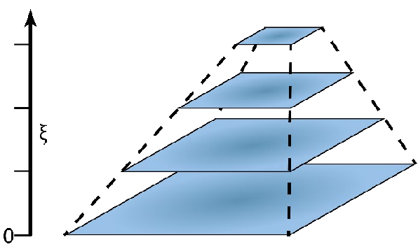

# Scale-Space Theory and Gaussian Pyramids

Scale-space theory and Gaussian pyramids are core concepts in computer vision and image processing. They help us analyze images at different levels of detail, which is crucial because real-world objects and features appear meaningful at various scales.

---

## Scale-Space Theory

**Scale-space theory** is a formal way to represent an image at multiple scales. The main idea is that to fully understand an image, you need to look at it not just at its original resolution, but also at progressively blurrier, coarser resolutions. This lets you find features that are prominent at different scales—think of a tiny button on a keyboard versus the whole keyboard's shape.

### Key Principles:

* **Multi-scale Representation:** The theory proposes creating a "scale-space" by transforming the original image into a series of smoothed images. A parameter, often 't' or '$\sigma^2$', controls the scale.
* **Gaussian Kernel:** A key finding is that the **Gaussian kernel** is the only smoothing filter that meets specific desirable rules for generating a scale-space. These rules include:
    * **Linearity and Shift-Invariance:** Smoothing should be linear and unaffected by image shifts.
    * **Causality:** As you go from finer to coarser scales, no new structures (like peaks or valleys) should appear. Features can only merge, disappear, or simplify.
    * **Isotropy:** Smoothing should be uniform in all directions.
* **Diffusion Equation:** You can also get the scale-space representation by solving the **diffusion equation** (or heat equation). This highlights how information gradually blurs out as the scale increases.
* **Scale Parameter ($\sigma$):** The standard deviation ($\sigma$) of the Gaussian kernel (or $t = \sigma^2$) directly controls the scale. A small $\sigma$ means fine details, while a large $\sigma$ means more blurring and the emergence of larger structures.

### Why it's Important:

Objects look different depending on their distance and size. A computer vision system needs to handle these variations without knowing the "correct" scale beforehand. Scale-space theory provides a principled way to:

* **Analyze features at their intrinsic scale:** Find features (edges, corners, blobs) that stand out most at a specific scale.
* **Automatic scale selection:** Methods exist to automatically figure out the most "characteristic" scale for a given feature.
* **Scale-invariant feature detection:** Detect features that are robust to changes in image scale, which is vital for tasks like object recognition (e.g., SIFT and SURF descriptors are based on scale-space ideas).

---

## Gaussian Pyramids

**Gaussian pyramids** are a practical and efficient way to approximate a continuous scale-space. They represent an image at multiple discrete levels of resolution and smoothing, forming a "pyramid" of images where each level is a smaller, blurred version of the one below it.

### Construction Process:

A Gaussian pyramid is built by repeatedly performing two main steps:

1.  **Smoothing (Gaussian Blur):** The current image level is convolved with a Gaussian filter. This blurs the image, removing fine details and preparing it for downsampling. The choice of Gaussian kernel here directly relates to scale-space theory.
2.  **Downsampling (Subsampling):** The smoothed image is then subsampled, usually by a factor of 2 in both width and height (e.g., removing every other row and column). This shrinks the image and effectively increases the "scale" or "level of abstraction."

This process is repeated to create successive levels of the pyramid. The original image is the base (level 0), and each subsequent level is a smaller, blurrier representation.

### Relationship to Scale-Space Theory:

* **Discrete Approximation:** A Gaussian pyramid is a discrete approximation of a continuous scale-space. While scale-space theory envisions a continuous range of scales, Gaussian pyramids provide a distinct set of scale levels.
* **Efficiency:** Pyramids are more computationally efficient than generating a truly continuous scale-space because downsampling reduces the number of pixels to process at higher levels.
* **Loss of Information:** Due to downsampling, some information is inherently lost in a Gaussian pyramid. This means that expanding a higher pyramid level back to the original size won't perfectly reconstruct the original image. (Laplacian pyramids address this by storing the "difference" information between pyramid levels).

### Applications:

Gaussian pyramids and multi-scale representation are widely used in computer vision for:

* **Feature Detection:** Finding interesting points (corners, blobs, edges) at different scales (e.g., SIFT, SURF).
* **Image Compression:** Representing images at multiple resolutions for efficient storage and transmission.
* **Image Blending:** Seamlessly combining two images by blending them at different pyramid levels.
* **Object Detection and Tracking:** Searching for objects of various sizes in an image.
* **Texture Analysis:** Analyzing patterns and textures that appear at different scales.

In short, scale-space theory provides the theoretical basis for understanding how image structures behave across scales, highlighting the importance of the Gaussian kernel. Gaussian pyramids offer a practical and efficient way to implement this multi-scale representation, used extensively in many computer vision applications.